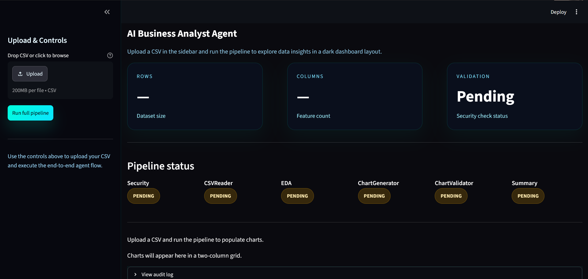

# AI Business Analyst Agent

This repository implements a small multi-agent data analysis pipeline that
accepts a CSV, runs deterministic security checks, profiles and analyses the
data, auto-generates charts, validates visuals, and produces a stakeholder
summary. The project is designed for transparency and reproducibility: every
agent is implemented as a small, testable Python module and the pipeline is
orchestrated by `src/agents/orchestrator.py`.

This README documents the implemented functionality exactly as found in the
codebase (no assumptions or guesses). See the referenced files for full
details.




## 1) Project overview — business problem solved

This project automates exploratory data analysis and lightweight reporting for
tabular CSV datasets. It is targeted at analysts who need quick, reproducible
insights (descriptive statistics, outliers, correlations), visualisations,
and a polished markdown summary while maintaining a strict security gate to
prevent prompt-injection or poisoned data from reaching LLMs.


## 2) Full 6-agent pipeline (implemented agents and responsibilities)

- `SecurityValidatorAgent` (`src/agents/security_agent.py`)
	- Deterministic CSV gate: header and cell regex scans, file size and schema
		checks. Returns `{status: PASSED|BLOCKED, reason, rows, cols}`.
- `CSVReaderAgent` (`src/agents/csv_reader_agent.py`)
	- Loads CSV (encoding detection via `src/tools/file_reader.py`), extracts
		schema (`shape`, `columns`, `dtypes`, `null_counts`) and attempts to
		write a profiling report when the optional profiling lib is available.
- `EDAAnalyzerAgent` (`src/agents/eda_agent.py`)
	- Computes descriptive statistics, null analysis, correlation matrix, and
		outlier detection using `src/tools/stats.py`. It also requests a concise
		natural-language summary via Ollama (`gpt-oss:20b-cloud`) and returns a
		structured dict including `llm_summary`.
- `ChartGeneratorAgent` (`src/agents/chart_agent.py`)
	- Decides chart types (via an LLM decision) and renders charts with
		`matplotlib` and `plotly` using helpers in `src/tools/chart_generator.py`.
		Supports histograms (with KDE), boxplots, heatmaps, line and bar charts.
- `ChartValidatorAgent` (`src/agents/chart_validator_agent.py`)
	- Validates generated charts against source CSV with rule-based checks
		(x-axis range, Sturges bin count, file size, KDE alignment, skewness).
		It can request human-readable fix instructions from the LLM and retry
		failed histogram regenerations up to 3 times.
- `SummaryAgent` (`src/agents/summary_agent.py`)
	- Re-reads CSV for an authoritative dataset overview, gathers EDA and
		chart metadata, and asks the LLM to produce a five-section markdown
		summary saved to `outputs/summary.md`.

The orchestrator that runs these agents end-to-end is
`src/agents/orchestrator.py`.


## 3) Streamlit frontend features (`src/app.py`)

- Upload CSV (sidebar) and run the full pipeline from the UI.
- Live pipeline status badges for the six agents.
- Metrics and evaluation summary (reads `outputs/eval_report.json` when
	available).
- Interactive plot panels (Plotly histograms and correlation heatmap)
	generated from the uploaded CSV.
- Raw data preview (first 50 rows) and a downloadable `summary.md` when
	produced.
- View the full `audit.log` contents in an expander.

Run the app with:

```bash
streamlit run src/app.py
```

## 4) Security features (exact patterns and rules implemented)

Security checks are implemented deterministically (no LLM). The code blocks
patterns listed in `src/tools/security.py` and `src/security/validator.py` are
the source of truth. Blocked patterns (exact list implemented):

```
ignore previous
system prompt
<script
DROP TABLE
__import__
os.system
eval(
exec(
```

Validation rules implemented:
- Minimum 2 columns required
- File size limit: 50 MB
- Empty files are rejected
- Header and first 100 rows scanned for blocked patterns

If `SecurityValidatorAgent` returns `BLOCKED` the orchestrator halts the
pipeline (fail-fast) and no data is sent to LLMs. See `docs/security.md` and
`src/security/validator.py`.

## 5) Agent Skills (`SKILL.md`) structure (progressive disclosure)

Each agent has a human-readable skill description placed under
`docs/agents/skills/<agent>/SKILL.md`. The orchestrator includes a
`skill_loader()` that reads the YAML frontmatter before running an agent and
logs lines such as:

```
Loaded skill: SecurityValidatorAgent [read-only]
```

Required frontmatter fields implemented in the SKILL files:
- `name` — agent canonical name
- `description` — short summary
- `triggers` — positive/negative trigger lists
- `tier` — one of `read-only` or `draft-only` (per the created SKILL.md files)

Each SKILL.md also contains the body sections: Objective, Input/Output
Contract, Step-by-step Workflow, Guardrails, References. See
`docs/agents/skills/` for the concrete files generated in this repository.

## 6) Tech stack (exact libs and models present in repository)

Runtime / libs (from `requirements.txt`):

- `google-adk` (listed)
- `pandas`
- `matplotlib`
- `plotly`
- `streamlit`
- `seaborn`
- `ydata-profiling` (listed, optional in code)
- `chardet`
- `scipy`
- `ollama`

Model usage (explicit in code):
- LLM calls are made via the Ollama Python SDK requesting the
	`gpt-oss:20b-cloud` model (see uses in `src/agents/eda_agent.py`,
	`src/agents/chart_agent.py`, `src/agents/summary_agent.py` and
	`src/agents/chart_validator_agent.py`).

No other LLM model identifiers are referenced in the codebase.

## 7) Directory structure (actual repository layout)

Top-level (excerpt):

- `data/` — sample CSVs and `uploads/`
	- `sample.csv`, `sample_large.csv`, `blocked_sample.csv`
- `docs/` — design notes, agent specs, SKILL.md files
- `outputs/` — generated artifacts (`profile.html`, `charts/`,
	`summary.md`, `eval_report.json`, `validation_report.md`)
- `src/` — implementation
	- `src/app.py` (Streamlit UI)
	- `src/agents/` (agent implementations and orchestrator)
	- `src/tools/` (charting, stats, file reader, security helpers)
	- `src/security/validator.py` (security validator implementation)
- `tests/` — `test_pipeline.py`
- `requirements.txt`
- `audit.log` — runtime audit trail

See the repository root for the full tree.

## 8) How to run — CLI and Streamlit

CLI (orchestrator):

```bash
python -m src.agents.orchestrator --input data/sample.csv
```

This runs the full pipeline end-to-end and writes outputs under `outputs/`.

Streamlit frontend:

```bash
streamlit run src/app.py
```

Notes:
- The CSVReaderAgent uses `sweetviz` if available; if not installed the
	agent logs that profiling is skipped (see `audit.log`).
- LLM calls require an accessible Ollama instance/configuration; the audit
	log contains examples of Ollama rate-limit errors observed during runs.

## 9) Eval metrics (`outputs/eval_report.json` keys)

The evaluation agent (`src/agents/eval_agent.py`) writes
`outputs/eval_report.json` with these keys (produced exactly by the code):

- `pipeline_duration_sec`
- `slowest_agent`
- `slowest_agent_sec`
- `llm_accuracy_score` (percentage or `null` if not computable)
- `llm_fallback_rate` (percentage)
- `chart_validation_retries` (int)
- `security_status` (`PASSED`/`BLOCKED`)
- `security_scan_time_sec`
- `total_llm_tokens` (int)

Example present in the repository: `outputs/eval_report.json`.

## 10) Test CSV files available

Under `data/` (used by the Streamlit demo and tests):

- `data/sample.csv` — small example dataset used during development
- `data/sample_large.csv` — larger sample (multi-hundred/thousand rows)
- `data/blocked_sample.csv` — contains blocked injection patterns to test
	the security gate


## 11) By the Numbers

These are based on actual runs during development, tested on a 2000-row CSV with 5 columns.

**Pipeline**
- Full pipeline completes in under 2 minutes on a 2000-row dataset
- Security scan runs in under 0.1 seconds before anything else touches the data
- Average of 3 LLM calls per full pipeline run

**Security**
- Catches 8 categories of injection patterns before data reaches any LLM
- If the security check fails, the pipeline stops immediately — no LLM calls are made, no data is processed further

**Agents**
- 7 agents, each handling one part of the problem
- Chart validator retries automatically up to 3 times if a chart does not pass checks
- All inference runs locally via Ollama — no data leaves the machine

**Practical Impact**
- Goes from a raw CSV file to charts, EDA stats, and a business summary in one command
- No configuration needed for different CSV structures — drop in any file and run

## 12) Known limitations (observed in code and logs)

- LLM availability and rate limits: multiple audit log entries show Ollama
	rate-limit (HTTP 429) errors. The agents include fallbacks (e.g., default
	chart choices) but LLM failures reduce report quality.
- Profiling library variance: `CSVReaderAgent` attempts to use `sweetviz` but
	the requirements list `ydata-profiling`. If the optional profiler is missing
	the agent logs and continues without the HTML profile.
- ChartGenerator relies on LLM-decided mappings; when the LLM response is
	invalid the agent falls back to deterministic heuristics which may not
	match desired chart types.
- Chart validation can trigger regeneration loops; currently the code will
	retry up to 3 times for bin-count issues and then fail the pipeline if
	unresolved.

## 13) Agentic coding methodology used

The implementation follows an explicit agentic pattern documented in the
repository:

- Deterministic safety-first gate (`SecurityValidatorAgent`) prevents unsafe
	inputs from reaching LLMs.
- Small, focused agents implement a single responsibility and return simple
	JSON-serialisable contracts (dicts).
- Progressive disclosure: each agent has a `SKILL.md` describing its intent
	and contract; the orchestrator reads these SKILL files before invoking an
	agent (see `skill_loader()` in `src/agents/orchestrator.py`).
- LLMs are used for decision-making and natural-language summaries, while
	numeric computations and validations are deterministic (NumPy/Pandas/Scipy).
- Validation + retry loop in `ChartValidatorAgent` demonstrates a human-in-the-loop
	style: deterministic checks produce actionable LLM feedback and controlled
	regeneration attempts.

---


